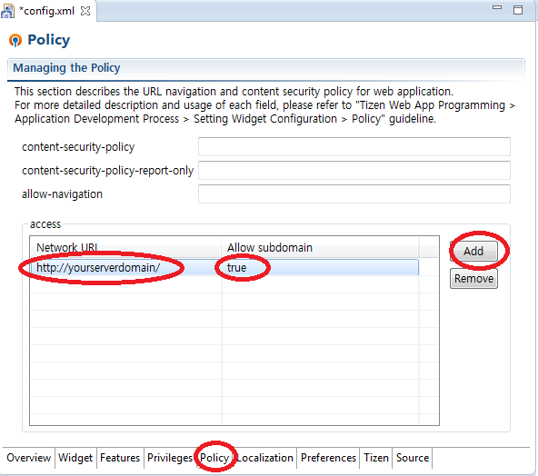

# 구 스마트TV 앱 → 타이젠 앱 변환 개발 가이드
[원문](http://www.samsungdforum.com/TizenGuide/?Foldername=tizen61&Filename=index.html) | [예제(GitHub)](https://github.com/Samsung/TizenTVApps) | [구글문서(번역)](https://docs.google.com/document/d/1i68mhSFFUp_XQMFy1kY3p1lfD_xgHbbBBQDNqfkACjk/edit?usp=sharing)

# 앱 마이그레이션
> 이 문서 가이드는 구 버전의 삼성 스마트TV 애플리케이션을 삼성 타이젠 기반 TV 애플리케이션으로 변환하는 방법에 대해서 다룹니다.

[TOC]

2014년도까지 삼성 스마트TV는 타이젠 기반이 아니었습니다. 따라서 구 버전의 애플리케이션을 타이젠 
기반 스마트TV에서 작동시키려면 마이그레이션 작업이 필요합니다. 구 버전의 애플리케이션과 타이젠 애플리케이션 모두 웹 기반이기 때문에, 여러분은 처음부터 개발을 다시 시작하지 않아도 됩니다. 아래 가이드에 따라서 옛 소스 코드를 수정하시면 됩니다.

## config.xml 설정파일
타이젠 애플리케이션은 W3C의 위젯 패키징 및 XML 설정 [Widget Packaging and XML Configuration)](http://www.w3.org/TR/2011/REC-widgets-20110927/#configuration-document)을 따릅니다. config.xml 의 규격은 웹 표준을 따르도록 수정되었습니다.
여러분은 타이젠 기반 삼성 스마트TV SDK의 IDE에서 손쉽게 config.xml 의 기본 템플릿을 만들 수 있습니다. 기본 템플릿으로 새 프로젝트를 생성하면 config.xml 을 사용할 수 있습니다. 관련 내용은 다음 링크를 참고하세요:
* [How to create new project 새 프로젝트 제작하기](http://www.samsungdforum.com/TizenGuide/tizen1221/index.html)
* [Guide for setting config.xml config.xml 설정 가이드](http://www.samsungdforum.com/TizenGuide/tizen151/index.html)
* [Mapping table for config.xml config.xml을 위한 매핑 테이블(구 버전과 새 버전 비교)](http://www.samsungdforum.com/TizenGuide/tizen251/index.html)

> config.xml에서 네트워크 정책을 꼭 설정해야 합니다. 이 부분이 구 버전의 플랫폼과 타이젠 사이에서 가장 큰 차이점 중 하나입니다. 타이젠은 W3C의 WARP 보안 정책을 적용하기 때문에 Policy 탭에서 서버 도메인을 추가해야 합니다.

> 

Policy 탭을 선택하고 Add 버튼을 클릭하세요. 그리고 여러분의 서버 주소 Network URI,를 안에 써놓고 Allow subdomain을 클릭해서 값을 true.로 변경합니다.

## Object 태그 및 common API
타이젠은 <object> 태그와 common API들에 기반한 구 버전의 API들을 지원하지 않습니다. 모든 플러그인 객체들과 common API들에 관련된 것들을 삭제하세요. 타이젠 애플리케이션은 아래와 같은 코드들이 사라져야 합니다. index.html 파일에서 관련 코드를 삭제하세요.

```html
<object id="pluginPlayer" border="0" classid="clsid:SAMSUNG-INFOLINK-PLAYER" style="position:absolute;z-index:50;left:0px;top:0px;width:1280px;height:720px;display:none;"></object>

<script type="text/javascript" language="javascript" src="$MANAGER_WIDGET/Common/API/Widget.js"></script>
<script type="text/javascript" language="javascript" src="$MANAGER_WIDGET/Common/API/TVKeyValue.js"></script>
<script type="text/javascript" language="javascript" src="$MANAGER_WIDGET/Common/API/Plugin.js"></script>
```

## Ready event 시작 이벤트
타이젠 애플리케이션은 플랫폼에 시작 이벤트(ready event)를 보낼 필요가 없습니다. 프로그램이 로드될 때 자동적으로 index.html이 실행됩니다. 타이젠 애플리케이션에서 아래와 같은 코드들을 삭제하세요.

```javascript
var widgetAPI = new Common.API.Widget();
widgetAPI.sendReadyEvent();
//or
curWidget.setPreference("ready", "true");
```

## alert function alert 함수
여러분은 더이상 로그를 찍기위해 alert을 사용할 수 없습니다. 타이젠 애플리케이션은 alert 함수를 사용하여 팝업창을 보여줍니다.


로그를 찍기 위해서는 console.log() 를 사용하세요. 자세한건 [디버깅](http://www.samsungdforum.com/TizenGuide/tizen1251/index.html)을 참고하세요

## 애플리케이션 해상도
타이젠 기반 삼성 TV 애플리케이션은 1920x1080 해상도를 가집니다. 대부분의 구 스마트 TV 애플리케이션은 1280x720 또는 960x540 해상도를 가집니다.
오래된 애플리케이션을 타이젠 TV 기반으로 변환하기 위해서는 여러분은 두 가지 중 한 가지 방법을 선택할 수 있습니다.
1920x1080 해상도를 위한 새로운 UI와 이미지 리소스를 준비합니다.
뷰포트 메타 태그를 사용해서 애플리케이션 화면을 확대합니다.

```html
<meta name="viewport" content="width=1280"/> //1280x720 해상도용
<meta name="viewport" content="width=960"/> //f960x540 해상도용
```

* [애플리케이션 해상도 가이드](http://www.samsungdforum.com/TizenGuide/tizen161/index.html)
* 다중 스크린 가이드 : [https://developer.tizen.org/dev-guide/2.2.1/org.tizen.web.appprogramming/html/multiple_screen/key_concepts.htm](https://developer.tizen.org/dev-guide/2.2.1/org.tizen.web.appprogramming/html/multiple_screen/key_concepts.htm)
* W3C 뷰포트 규격 : [http://www.w3.org/TR/mwabp/#bp-viewport](http://www.w3.org/TR/mwabp/#bp-viewport)


## TV 키 값
타이젠 기반 삼성 TV의 TV 키 값이 구 스마트 TV에서 변경되었습니다. 자세한 키 값은 [스마트 컨트롤러](http://www.samsungdforum.com/TizenGuide/tizen231/index.html) 및 적외선 리모트 콘트롤러(즉 리모콘) 관련 내용을 참고하세요.

## IME 입력기
타이젠 기반 TV 애플리케이션은 플랫폼에서 IME 입력기를 지원하기 때문에 더이상 IMEShell을 호출하지 않아도 됩니다. 입력 태그(input tag)에 포커스가 가면 작동적으로 IME 입력기가 나타날 것입니다.
따라서 오래된 IME 관련된 코드들을 삭제하세요. 자세한 정보는 [입력기 사용법](http://www.samsungdforum.com/TizenGuide/tizen271/index.html)을 참고하세요.

## 마우스 지원
타이젠 기반 삼성 TV는 포인팅 UX를 기본적으로 지원합니다. 따라서 더이상 `config.xml` 에서 mouse-support 옵션을 ‘y’로 설정할 필요가 없습니다. 왜냐하면 포인팅 UX가 기본적으로 제공하기 때문에 클릭 이벤트 핸들러를 추가하여 사용하면 됩니다.
자세한 것은 [스마트 컨트롤러](http://www.samsungdforum.com/TizenGuide/tizen231/index.html)에서 클릭 이벤트를 추가하는 법에 대한 내용을 참고하세요.

## 멀티태스킹 앱 지원
타이젠 기반 삼성 TV는 멀티태스킹을 기본적으로 지원합니다. 따라서 더이상 `config.xml` 에서 multiapp-support 설정을 'y'로 할 필요가 없으며 멀티태스킹 핸들러를 추가하여 사용할 수 있습니다.
타이젠의 멀티태스킹은 기존의 오래된 스마트 TV와 다르게 멀리태스킹을 처리합니다. 따라서 `sendReturnEvent` 와 `onpause`, `onresume` 함수들을 삭제합니다.
자세한 내용은 [멀티태스킹](http://www.samsungdforum.com/TizenGuide/tizen51/index.html)을 참고하세요.

> 이 함수는 에뮬레이터에서만 작동합니다.(시뮬레이터에서는 작동하지 않습니다.) 에뮬레이터에서 사용하고자 합니다면 private SDK를 필요로 합니다.

> 만약 필요하다면 sdfadmin@samsung.com으로 연락하길 바랍니다.

## AppsFramework 마이그래이션
옛 애플리케이션이 `ppsFramework`(구버전 sdk에서 제공하는 위젯 등의 기능들을 제공하는 프레임워크)를 사용한다면 전체 프레임워크를 제거해야해서 부담이 큽니다. 그래서  [AppsFramework](http://www.samsungdforum.com/TizenGuide/tizen321/index.html)에서 래퍼(wrapper) 라이브러리를 제공합니다.

만약 애플리케이션에 다음과 같은 코드들이 존재한다면 `AppsFramework`을 사용하고 있는 것입니다.

```html
"$MANAGER_WIDGET/Common/core.js"
```

```html
$MANAGER_WIDGET/Common/af/2.0.0"
```

이러한 경우에는 [AppsFramework](http://www.samsungdforum.com/TizenGuide/tizen321/index.html)를 참고하세요.

## 멀티미디어 플레이어
타이젠 애플리케이션에서 멀티미디어 플레이어를 2가지 방법으로 사용할 수 있습니다.
* HTML5 `video` 태그를 사용할 수 있습니다. 하지만 이 방법은 DRM이나 DASH, HAS, HLS 그리고 스무스스트리밍 같은 스트리밍 엔진을 지원하지 않습니다.
* `avplay API` 또는 삼성 TV에서 제공하는 API를 사용할 수 있습니다. 이 API는 DRM과  DASH, HAS, HLS 그리고 스무스스트리밍 같은 스트리밍 엔진을 지원합니다.

> avplay API는 private SDK에서만 사용할 수 있습니다.
> 만약 private SDK가 필요하다면 sdfadmin@samsung.com로 연락하시기 바랍니다.

여러분의 애플리케이션이 간단한 기능을 사용하고 DRM이나 스트리밍 엔진 없이 멀티미디어를 재생한다면 간편하게 HTML5 `<video>` 태그를 사용하세요.

만약 RM 또는 스트리밍 엔진을 사용한다면 avplay API를 사용하세요.

## 파일시스템 API
구 스마트TV는 두 가지 파일시스템 API를 제공했습니다.
* (흔히 `Browser API`라고 하는) `new FileSystem()` 으로 호출한 파일시스템
* (흔히 `WebAPI`라고 하는) `webapis.filesystem` 으로 호출한 파일시스템
두 API는 각각 다른 특징과 메소드를 사용하기에 마이그래이션 방법도 각각 다릅니다.

### 파일시스템 (Browser API)
`Browser API` 파일시스템의 주요한 특징은 동기화(synchronous) API라는 점입니다. 불행히도 타이젠은 비동기 파일시스템 PI만 제공합니다.

다음 중 하나를 선택하세요.
* 애플리케이션 흐름을 비동기 API에 적합하게 만들어 `타이젠 파일시스템 API`를 사용하세요. 자세한 것은 [https://developer.tizen.org/dev-guide/2.2.0/org.tizen.web.device.apireference/tizen/filesystem.html](https://developer.tizen.org/dev-guide/2.2.0/org.tizen.web.device.apireference/tizen/filesystem.html)을 참고하세요.
* W3C `WebStorage API`를 사용하세요. 자세한 것은  [https://developer.tizen.org/dev-guide/2.2.1/org.tizen.web.appprogramming/html/guide/w3c_guide/storage_guide/web_storage.htm](https://developer.tizen.org/dev-guide/2.2.1/org.tizen.web.appprogramming/html/guide/w3c_guide/storage_guide/web_storage.htm)을  참고하세요.


> W3C `WebStorage API` 는 보안이 매우 취약합니다. 이 API는 개별 전용(private) 저장공간을 제공하지 않습니다. 따라서 보안이나 개인 정보 등에서는 WebStorage를 사용하지 마세요.

> W3C `WebStorage API`는 단지 5MB의 저장 용량을 제공합니다. 큰 데이터를 저장하는데 사용하지 마세요.

### 파일시스템 예제(Browser API)
##### 구 파일시스템 API
```javascript
var filesystemObj = new FileSystem();
var fileObj = fileSystem.obj.openCommonFile(curWidget.id + "sample.data", "w");
fileObj.writeAll("Something to write.");
var str = fileObj.readAll();
filesystemObj.closeCommonFile(fileObj);
filesystemObj.deleteCommonFile(curwidget.id + "sample.data");
```

##### 타이젠 파일시스템 API
```javascript
var str;
tizen.filesystem.resolve("wgt-private", function(dir){
    dir.createFile("sample.data");
    dir.resolve("wgt-private/sample.data").openStream("rw", function(stream){
        stream.write("Something to write.");
        str = stream.read(100);
        stream.close();
        tizen.filesystem.resolve("wgt-private", function(dir2){
            dir2.deleteFile("wgt-private/sample.data");
        });
    });
});
```

##### W3C WebStorage API
```javascript
localStorage.setItem("sample", "something to write.");
var str = localStorage.getItem("sample");
localStorage.removeItem("sample");
```


### 파일시스템 예제(Web API)
이 API는 비동기(asynchronous) API이며 API 사용법(spec)이 [타이젠 파일시스템 API](https://developer.tizen.org/dev-guide/2.2.1/org.tizen.web.device.apireference/tizen/filesystem.html#::Filesystem)과 거의 유사하기 때문에 쉽게 변환할 수 있습니다.

### 파일시스템 예제(WebAPI)

##### WebAPI 파일시스템 API
```javascript
var str;
webapis.filesystem.resolve("wgt-private", function(dir){
    dir.createFile("sample.data");
    dir.resolve("wgt-private/sample.data").openStream("rw", function(stream){
        stream.write("Something to write.");
        str = stream.read(100);
        stream.close();
        webapis.filesystem.resolve("wgt-private", function(dir2){
            dir2.deleteFile("wgt-private/sample.data");
        });
    });
});
```

##### 타이젠 파일시스템 API
```javascript
var str;
tizen.filesystem.resolve("wgt-private, function(dir){
    dir.createFile("sample.data");
    dir.resolve("wgt-private/sample.data").openStream("rw", function(stream){
        stream.write("Something to write.");
        str = stream.read(100);
        stream.close();
        tizen.filesystem.resolve("wgt-private", function(dir2){
            dir2.deleteFile("wgt-private/sample.data");
        });
    });
});
```

## 인식(음성인식, 제스처 인식)
2015년도 타이젠 기반 삼성 TV에서는 애플리케이션에서 음성인식, 제스쳐 인식을 지원하지 않습니다. 이러한 기능들은 모두 제거하세요.


## 구 스마트TV의 API 변경 방법
구 스마트TV의 API에서 제공하는 몇 가지 기능들은 더이상 지원하지 않거나 타이젠 기반 TV의 API에 반영되었습니다.
API들에 대한 것은 [API 레퍼런스](http://www.samsungdforum.com/TizenApiGuide/?FolderName=tizen1061&FileName=index.html)에서 확인할 수 있습니다.

## 앱 변환 가이드 1.05
* [타이젠 앱 변환 가이드 1.05.pdf](http://www.samsungdforum.com/TizenGuide/_downloads/Tizen_AppConverting_Guide_1_05.pdf)
